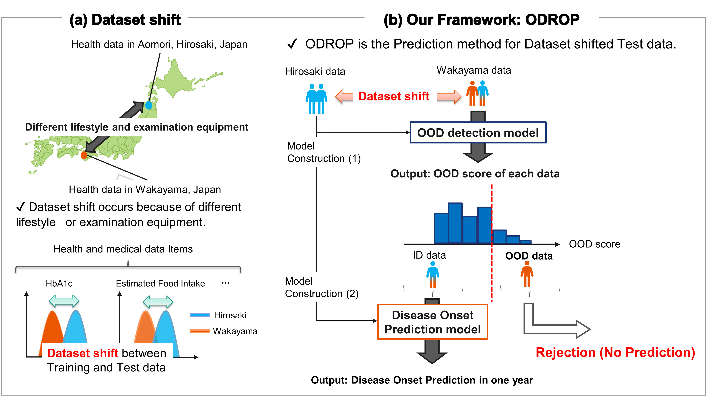

# OOD4Tab
==============================

This repository is the official code of "Out-of-distribution Reject Option Method for Dataset Shift Problem in Early Disease Onset Prediction".

    

- Our proposed method **"Out-of-distribution Reject Option (ODROP)"** enables reliable and accurate predictions across health and medical data affected by dataset shift without updating the prediction model. 
- This repository contains toy examples using ODROP method.
- The detailed usage is explained in the notebooks.
- The OOD detection methods including this repository are followings:
  - VAE Reconstruction Loss
  - NN Classifier Ensemble Std
  - NN Classifier Ensemble Epistemic
  - NN Classifier Energy Score
  - NN Classifier Gaussian mixture-based Energy Measurement (GEM)

Project Organization
------------

    ├── data
    │   ├── external       <- Toy data is here.
    │
    ├── docs               
    │
    ├── models
    │
    ├── notebooks          <- Jupyter notebooks for example.
    │              
    ├── references         
    │
    ├── reports            
    │   └── figures        <- Generated figures
    │
    ├── requirements.txt   <- The requirements file for reproducing the analysis environment.
    │
    ├── setup.py           <- makes project pip installable (pip install -e .) so src can be imported
    ├── src                <- Source code for use in this project.
    │   ├── __init__.py    
    │   │
    │   ├── data           
    │   │   └── make_dataset.py  <- Scripts for generating toy dataset.
    │   │
    │   │
    │   ├── models         <- Scripts to train models and then use trained models.
    │   │   │
    │   │   ├── weight                <- model weight               
    │   │   ├── adversarial_train.py  <- adversarial training (ensemble) models 
    │   │   ├── NN.py                 <- Simple Binary Classification NN model
    │   │   └── train_model.py        <- training (ensemble) Simple NN models
    │   │
    │   └── OODmetrics
    │   │       ├── ensemble.py       <- epistemic, aleatoric uncertainty
    │   │       └── nn_posthoc.py     <- post hoc method with Simple NN Classifier for OOD score. ex: Energy-based, GEM score
    │   └── utils
    │   │     └── util.py             <- for Rejection curve plot    
    │   │
    │   └── visualization  <- Scripts to create exploratory and results oriented visualizations
    │       └── visualize.py

--------

<small>Project based on the <a target="_blank" href="https://drivendata.github.io/cookiecutter-data-science/">cookiecutter data science project template</a>. #cookiecutterdatascience</small>

